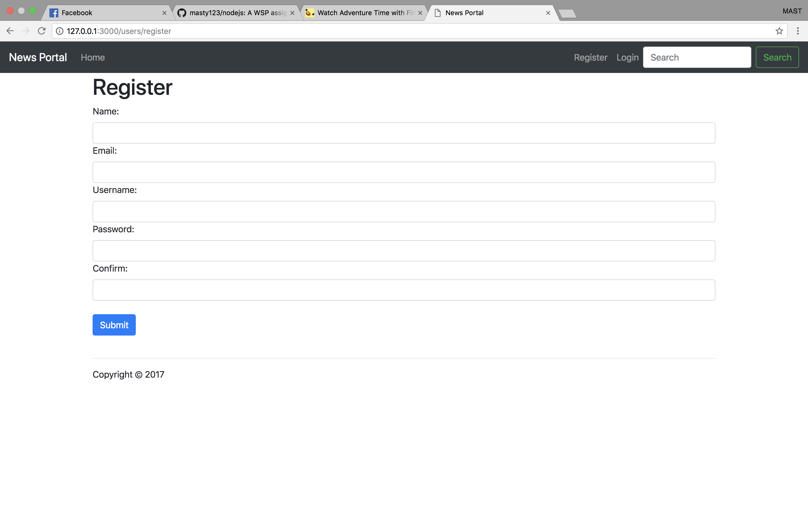

# Article Website with Nodejs, Mongoose and stuff

### This repository is all about learning how to build a website with Nodejs, Mongoose javascript etc.

#### This was an assignment for Workgroup Software Development Process Course.

#### If you want to run: 1. type "mongod" in the program directory console 2. open another console and type "nodejs index.js"

#### These are the screenshots

